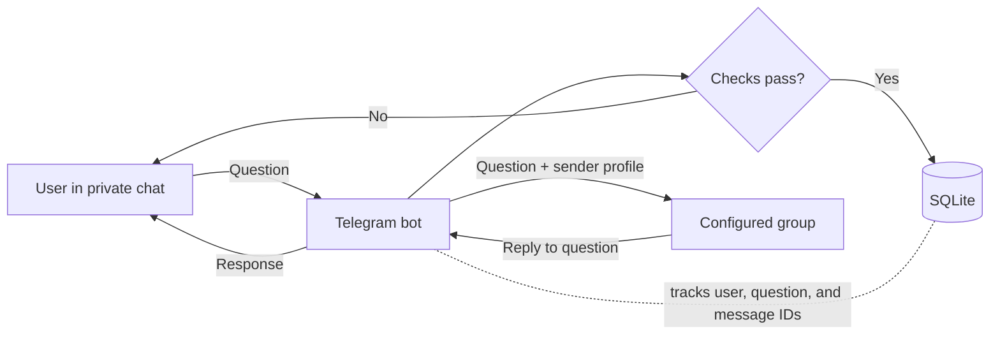

# Telegram Q&A Bot

**A reusable Telegram bot template for collecting questions privately and handling replies in a group.**

> [!WARNING]
> Questions are **not anonymous**. The sender's Telegram name and account ID are included with each question and visible to group members.

## Contents

- [Overview](#overview)
- [Features](#features)
- [How it works](#how-it-works)
- [Project structure](#project-structure)
- [Webhook endpoints](#webhook-endpoints)
- [Configuration](#configuration)
- [Data storage](#data-storage)
- [Current limitations](#current-limitations)

## Overview

The bot forwards private messages to a configured Telegram group and routes replies back to the original sender. It uses **python-telegram-bot** to handle Telegram interactions, **Flask** to receive webhook updates, and **SQLite** to store application data.

## Features

| | Feature | Description |
|:--:|---|---|
| 💬 | Private questions | Forward text and supported media from private chats to a group. |
| ↩️ | Reply routing | Deliver group replies to the right user using tracking IDs and message mappings. |
| 🛡️ | Access controls | Optional channel-membership checks, cooldowns, rate limits, question limits, and bans. |
| 📊 | Admin tools | Moderation, statistics, polls, quizzes, tracking codes, and follow-up threads. |
| 🧩 | Group registration | `/setgroup` records groups for planned multi-group support; routing still uses `GROUP_ID`. |

## How it works

1. Telegram sends an update to `/webhook`; the bot validates the webhook secret before processing it.
2. The bot registers the user and, when enabled, checks channel membership.
3. It checks whether the user is banned and enforces rate limits, the question cooldown, and the lifetime question limit. GIFs are rejected.
4. For an accepted question, the bot creates a tracking ID, stores the question and sender details, and forwards it with the sender's profile to the configured group.
5. A group member replies to the forwarded question. The bot uses saved message mappings to deliver the response to the original user and support follow-ups.

## Project structure

| File | Responsibility |
|---|---|
| `bot.py` | Runtime configuration, Telegram handlers, question/reply logic, SQLite operations, and Flask application. |
| `.env.example` | Example environment variable names and values. It is a reference only; the app does not load it automatically. |
| `requirements.txt` | Python dependencies. |
| `Procfile` | Process start command: `python bot.py`. |

## Webhook endpoints

| Method and path | Purpose |
|---|---|
| `POST /webhook` | Receives Telegram updates. Requests must include a valid `X-Telegram-Bot-Api-Secret-Token` header. |
| `POST /set_webhook` | Registers the webhook. Requires `WEBHOOK_SETUP_KEY` in the `X-Webhook-Setup-Key` header. |
| `GET /` | Returns a basic status response. |

The webhook secret and setup key are separate credentials: Telegram uses the former to authenticate update requests, while the latter protects webhook registration.

## Configuration

Set these values through environment variables. `BOT_TOKEN` and `GROUP_ID` are essential to normal operation; the remaining settings are optional unless webhook registration is being used.

| Variable | Default | Purpose |
|---|---:|---|
| `BOT_TOKEN` | — | Telegram bot token. **Keep it private.** |
| `GROUP_ID` | `0` | Numeric ID of the group that receives questions. |
| `CHANNEL_ID` | Empty | Channel username or ID for membership checks. Empty disables the check. |
| `CHANNEL_URL` | Empty | Membership link shown to users. |
| `QUESTION_COOLDOWN` | `600` | Minimum seconds between questions from one user. |
| `MAX_QUESTIONS` | `50` | Maximum lifetime question count per user. |
| `WEBHOOK_SETUP_KEY` | Empty | Separate secret required to register the webhook. |
| `WEBHOOK_SECRET_TOKEN` | Empty | Secret used to validate Telegram webhook requests. |
| `DOMAIN` | Empty | Webhook hostname; when empty, the request host is used. |
| `DB_PATH` | `bot_data.db` | Path to the SQLite database file. |
| `PORT` | `5000` | Port used by the Flask server. |

> **Security:** Never commit real tokens, webhook secrets, `.env` files, databases, or private user data. Keep `.env.example` populated with placeholders only.

## Data storage

At startup, the bot creates or updates the tables in `DB_PATH`. SQLite stores users, questions, message mappings, registered groups, bans, and quiz data. Keep the database file on storage that survives application restarts if this data needs to persist.

Rate-limit state and temporary state—such as pending answer confirmations—are held in memory and reset when the process restarts.

## Current limitations

- `/setgroup` saves a group ID and can only be run by an admin of that group. It does **not** enable multi-group question routing: question delivery and many admin commands still depend on `GROUP_ID`.
- Registering a group does not grant the bot Telegram admin permissions.
- Preserve mappings between group messages, questions, and users when changing routing. Replies, follow-ups, and some moderation actions depend on them.
- User-facing bot messages are currently in Persian; customize the messages and quiz content when adapting the template.
