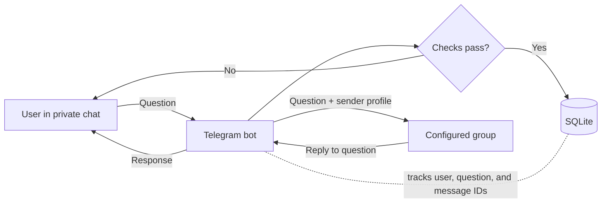
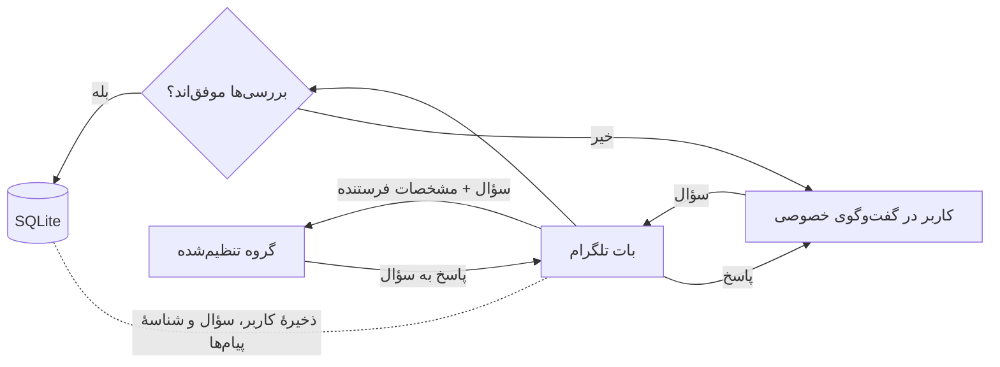

# Telegram Q&A Bot

**A reusable Telegram bot template for collecting questions privately and handling replies in a group.**

[English](#telegram-qa-bot) · [فارسی](#فارسی)

> [!WARNING]
> Questions are **not anonymous**. The sender's Telegram name and account ID are included with each question and visible to group members.

## Contents

- [Overview](#overview)
- [Features](#features)
- [How it works](#how-it-works)
- [Project structure](#project-structure)
- [Webhook endpoints](#webhook-endpoints)
- [Configuration](#configuration)
- [Data storage](#data-storage)
- [Current limitations](#current-limitations)

## Overview

The bot forwards private messages to a configured Telegram group and routes replies back to the original sender. It uses **python-telegram-bot** to handle Telegram interactions, **Flask** to receive webhook updates, and **SQLite** to store application data.

## Features

| | Feature | Description |
|:--:|---|---|
| 💬 | Private questions | Forward text and supported media from private chats to a group. |
| ↩️ | Reply routing | Deliver group replies to the right user using tracking IDs and message mappings. |
| 🛡️ | Access controls | Optional channel-membership checks, cooldowns, rate limits, question limits, and bans. |
| 📊 | Admin tools | Moderation, statistics, polls, quizzes, tracking codes, and follow-up threads. |
| 🧩 | Group registration | `/setgroup` records groups for planned multi-group support; routing still uses `GROUP_ID`. |

## How it works

1. Telegram sends an update to `/webhook`; the bot validates the webhook secret before processing it.
2. The bot registers the user and, when enabled, checks channel membership.
3. It checks whether the user is banned and enforces rate limits, the question cooldown, and the lifetime question limit. GIFs are rejected.
4. For an accepted question, the bot creates a tracking ID, stores the question and sender details, and forwards it with the sender's profile to the configured group.
5. A group member replies to the forwarded question. The bot uses saved message mappings to deliver the response to the original user and support follow-ups.

## Project structure

| File | Responsibility |
|---|---|
| `bot.py` | Runtime configuration, Telegram handlers, question/reply logic, SQLite operations, and Flask application. |
| `.env.example` | Example environment variable names and values. It is a reference only; the app does not load it automatically. |
| `requirements.txt` | Python dependencies. |
| `Procfile` | Process start command: `python bot.py`. |

## Webhook endpoints

| Method and path | Purpose |
|---|---|
| `POST /webhook` | Receives Telegram updates. Requests must include a valid `X-Telegram-Bot-Api-Secret-Token` header. |
| `POST /set_webhook` | Registers the webhook. Requires `WEBHOOK_SETUP_KEY` in the `X-Webhook-Setup-Key` header. |
| `GET /` | Returns a basic status response. |

The webhook secret and setup key are separate credentials: Telegram uses the former to authenticate update requests, while the latter protects webhook registration.

## Configuration

Set these values through environment variables. `BOT_TOKEN` and `GROUP_ID` are essential to normal operation; the remaining settings are optional unless webhook registration is being used.

| Variable | Default | Purpose |
|---|---:|---|
| `BOT_TOKEN` | — | Telegram bot token. **Keep it private.** |
| `GROUP_ID` | `0` | Numeric ID of the group that receives questions. |
| `CHANNEL_ID` | Empty | Channel username or ID for membership checks. Empty disables the check. |
| `CHANNEL_URL` | Empty | Membership link shown to users. |
| `QUESTION_COOLDOWN` | `600` | Minimum seconds between questions from one user. |
| `MAX_QUESTIONS` | `50` | Maximum lifetime question count per user. |
| `WEBHOOK_SETUP_KEY` | Empty | Separate secret required to register the webhook. |
| `WEBHOOK_SECRET_TOKEN` | Empty | Secret used to validate Telegram webhook requests. |
| `DOMAIN` | Empty | Webhook hostname; when empty, the request host is used. |
| `DB_PATH` | `bot_data.db` | Path to the SQLite database file. |
| `PORT` | `5000` | Port used by the Flask server. |

> **Security:** Never commit real tokens, webhook secrets, `.env` files, databases, or private user data. Keep `.env.example` populated with placeholders only.

## Data storage

At startup, the bot creates or updates the tables in `DB_PATH`. SQLite stores users, questions, message mappings, registered groups, bans, and quiz data. Keep the database file on storage that survives application restarts if this data needs to persist.

Rate-limit state and temporary state—such as pending answer confirmations—are held in memory and reset when the process restarts.

## Current limitations

- `/setgroup` saves a group ID and can only be run by an admin of that group. It does **not** enable multi-group question routing: question delivery and many admin commands still depend on `GROUP_ID`.
- Registering a group does not grant the bot Telegram admin permissions.
- Preserve mappings between group messages, questions, and users when changing routing. Replies, follow-ups, and some moderation actions depend on them.
- User-facing bot messages are currently in Persian; customize the messages and quiz content when adapting the template.

---

## فارسی

[رفتن به نسخهٔ انگلیسی](#telegram-qa-bot)

### معرفی

این قالب یک بات پرسش‌وپاسخ تلگرام است که پیام‌های خصوصی کاربران را به یک گروه مشخص می‌فرستد و پاسخ‌های گروه را به کاربر اصلی برمی‌گرداند. بات از **python-telegram-bot** برای ارتباط با تلگرام، **Flask** برای دریافت به‌روزرسانی‌های webhook و **SQLite** برای ذخیرهٔ داده‌ها استفاده می‌کند.

> [!WARNING]
> سؤال‌ها **ناشناس نیستند**. نام و شناسهٔ حساب تلگرام فرستنده همراه هر سؤال برای اعضای گروه نمایش داده می‌شود.

### قابلیت‌ها

| قابلیت | توضیحات |
|---|---|
| پرسش خصوصی | ارسال متن و رسانه‌های پشتیبانی‌شده از گفت‌وگوی خصوصی به گروه. |
| مسیریابی پاسخ | بازگرداندن پاسخ گروه به کاربر با استفاده از شناسهٔ پیگیری و نگاشت پیام‌ها. |
| کنترل دسترسی | بررسی اختیاری عضویت در کانال، محدودیت نرخ و فاصلهٔ ارسال، سقف تعداد سؤال و مسدودسازی کاربران. |
| ابزارهای مدیریتی | مدیریت، آمار، نظرسنجی، آزمون، کدهای پیگیری و گفت‌وگوهای پیگیری. |
| ثبت گروه | دستور `/setgroup` گروه‌ها را برای پشتیبانی چندگروهی در آینده ثبت می‌کند؛ مسیریابی فعلی همچنان از `GROUP_ID` استفاده می‌کند. |

### روند کار

1. تلگرام به‌روزرسانی را به مسیر `/webhook` می‌فرستد؛ بات پیش از پردازش، secret مربوط به webhook را اعتبارسنجی می‌کند.
2. بات کاربر را ثبت می‌کند و در صورت فعال‌بودن بررسی عضویت، عضویت او در کانال را بررسی می‌کند.
3. بات مسدودبودن کاربر، محدودیت نرخ ارسال، فاصلهٔ زمانی میان سؤال‌ها و سقف کلی سؤال‌های او را بررسی می‌کند. ارسال GIF پذیرفته نمی‌شود.
4. برای سؤال پذیرفته‌شده، شناسهٔ پیگیری ساخته و اطلاعات سؤال و فرستنده ذخیره می‌شود؛ سپس سؤال همراه مشخصات فرستنده به گروه می‌رود.
5. یکی از اعضای گروه به پیام سؤال پاسخ می‌دهد. بات با کمک نگاشت پیام‌های ذخیره‌شده، پاسخ را به کاربر اصلی می‌فرستد و پیگیری‌های بعدی را پشتیبانی می‌کند.

### ساختار پروژه

| فایل | کاربرد |
|---|---|
| `bot.py` | تنظیمات زمان اجرا، handlerهای تلگرام، منطق سؤال و پاسخ، عملیات SQLite و برنامهٔ Flask. |
| `.env.example` | نمونهٔ نام و مقدار متغیرهای محیطی؛ فقط مرجع است و برنامه آن را خودکار بارگذاری نمی‌کند. |
| `requirements.txt` | وابستگی‌های Python. |
| `Procfile` | فرمان شروع فرایند: `python bot.py`. |

### مسیرهای webhook

| روش و مسیر | کاربرد |
|---|---|
| `POST /webhook` | دریافت به‌روزرسانی‌های تلگرام؛ درخواست باید هدر معتبر `X-Telegram-Bot-Api-Secret-Token` داشته باشد. |
| `POST /set_webhook` | ثبت webhook؛ به `WEBHOOK_SETUP_KEY` در هدر `X-Webhook-Setup-Key` نیاز دارد. |
| `GET /` | برگرداندن وضعیت سادهٔ برنامه. |

secret مربوط به webhook و کلید ثبت آن دو مقدار جدا هستند: تلگرام از secret برای اعتبارسنجی درخواست‌های به‌روزرسانی استفاده می‌کند و کلید دیگر از مسیر ثبت webhook محافظت می‌کند.

### تنظیمات

مقادیر زیر از طریق متغیرهای محیطی تنظیم می‌شوند. `BOT_TOKEN` و `GROUP_ID` برای کارکرد عادی ضروری‌اند؛ بقیه اختیاری هستند، مگر آن‌که از ثبت webhook استفاده شود.

| متغیر | پیش‌فرض | کاربرد |
|---|---:|---|
| `BOT_TOKEN` | — | توکن بات تلگرام؛ **محرمانه نگه دارید.** |
| `GROUP_ID` | `0` | شناسهٔ عددی گروهی که سؤال‌ها را دریافت می‌کند. |
| `CHANNEL_ID` | خالی | نام کاربری یا شناسهٔ کانال برای بررسی عضویت؛ خالی‌بودن آن بررسی را غیرفعال می‌کند. |
| `CHANNEL_URL` | خالی | پیوند عضویت که به کاربران نشان داده می‌شود. |
| `QUESTION_COOLDOWN` | `600` | حداقل فاصلهٔ زمانی میان سؤال‌های یک کاربر، برحسب ثانیه. |
| `MAX_QUESTIONS` | `50` | حداکثر تعداد سؤال هر کاربر در کل. |
| `WEBHOOK_SETUP_KEY` | خالی | کلید جداگانهٔ لازم برای ثبت webhook. |
| `WEBHOOK_SECRET_TOKEN` | خالی | secret لازم برای اعتبارسنجی درخواست‌های webhook تلگرام. |
| `DOMAIN` | خالی | میزبان webhook؛ اگر خالی باشد، میزبان درخواست استفاده می‌شود. |
| `DB_PATH` | `bot_data.db` | مسیر فایل پایگاه‌دادهٔ SQLite. |
| `PORT` | `5000` | پورتی که سرور Flask روی آن اجرا می‌شود. |

> **امنیت:** توکن‌ها، secretهای webhook، فایل `.env`، پایگاه‌داده یا اطلاعات خصوصی کاربران را commit نکنید. در `.env.example` فقط از مقادیر نمونه استفاده کنید.

### ذخیره‌سازی داده‌ها

بات هنگام شروع، جدول‌های موردنیاز را در مسیر `DB_PATH` ایجاد یا به‌روزرسانی می‌کند. SQLite اطلاعات کاربران، سؤال‌ها، نگاشت پیام‌ها، گروه‌های ثبت‌شده، کاربران مسدودشده و داده‌های آزمون را ذخیره می‌کند. اگر حفظ این اطلاعات لازم است، فایل پایگاه‌داده باید در فضایی نگه‌داری شود که با راه‌اندازی مجدد برنامه پاک نشود.

وضعیت محدودیت نرخ ارسال و بعضی وضعیت‌های موقت—مانند پاسخ‌هایی که منتظر تأیید هستند—در حافظه نگه‌داری می‌شوند و با راه‌اندازی مجدد فرایند از بین می‌روند.

### محدودیت‌های فعلی

- دستور `/setgroup` شناسهٔ گروه را ذخیره می‌کند و فقط ادمین همان گروه می‌تواند آن را اجرا کند. این دستور **مسیریابی چندگروهی را فعال نمی‌کند**؛ ارسال سؤال و بسیاری از فرمان‌های مدیریتی همچنان به `GROUP_ID` وابسته‌اند.
- ثبت گروه به‌تنهایی دسترسی مدیریتی تلگرام به بات نمی‌دهد.
- هنگام تغییر مسیریابی، نگاشت میان پیام‌های گروه، سؤال‌ها و کاربران را حفظ کنید؛ پاسخ‌ها، پیگیری‌ها و برخی عملیات مدیریتی به آن وابسته‌اند.
- متن‌های قابل‌نمایش بات فعلاً فارسی هستند؛ هنگام استفادهٔ مجدد از قالب، پیام‌ها و محتوای آزمون را متناسب با مخاطبان خود تغییر دهید.

[بازگشت به ابتدای README](#telegram-qa-bot)
